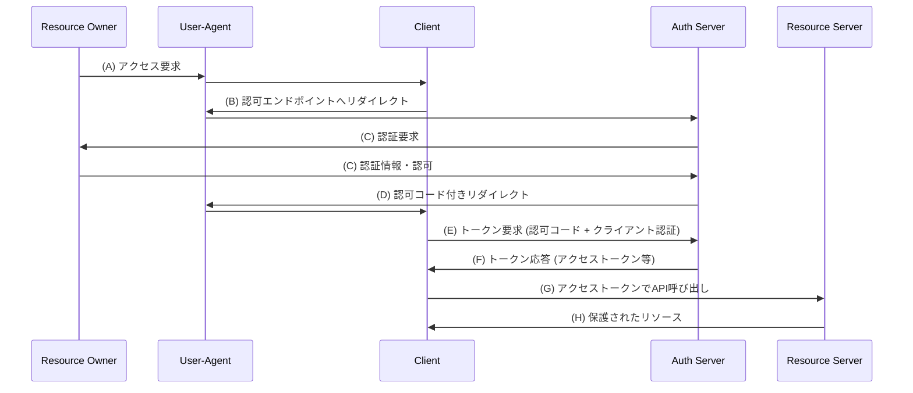
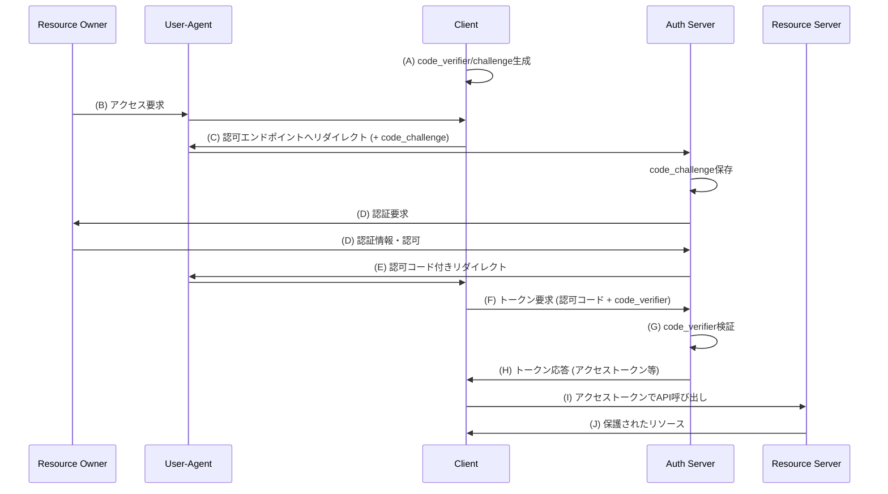

# SSRアプリケーションにおけるPKCE付き認可コードフロー

OAuth 2.0の認可コードフローとPKCEの仕組みを理解する

---

# 認可コードフロー

Authorization Code Grant

- RFC 6749 `The OAuth 2.0 Authorization Framework` で定義される認可フローの一つ
- クライアントアプリケーションがユーザーの代わりにリソースサーバーにアクセスする権限を取得
- アクセストークンの直接的な露出を防ぐ
- OAuth 2.0で最も安全かつ標準的とされる認可フロー

---

# 認可コードフローの流れ

---

# PKCE付き認可コードフローとは

Authorization Code Grant with Proof Key for Code Exchange

- RFC 7636 `Proof Key for Code Exchange by OAuth Public Clients` で定義される認可コードフローの拡張
- パブリッククライアント（SPAやモバイルアプリ）向けのセキュリティ強化
- 認可コード横取り攻撃を防ぐ
- クライアントシークレットが安全に保管できない環境でも使用可能
- 動的に生成されるcode_verifierとcode_challengeを使用

---

# PKCE付き認可コードフローの流れ

---

# SSRでもPKCEを使うべき理由

RFC 9700とOAuth 2.1が示す新しいセキュリティ基準

- **OAuth 2.1** (draft) - すべてのクライアントでPKCEを必須化
  - コンフィデンシャルクライアント（SSR含む）でも必須
  - 認可コード横取り攻撃への包括的な対策
- **RFC 9700** - OAuth 2.0セキュリティ現行ベストプラクティス
  - PKCEをすべての認可コードフローで推奨
  - クライアントタイプに関わらず実装すべき
- **SSRアプリケーションでの利点**
  - エッジ環境でのシークレット管理リスクを軽減
  - 将来的な標準への準拠
  - 統一的なセキュリティモデルの採用

---

# 主要認証ライブラリのPKCEサポート状況

| ライブラリ                | PKCEサポート | 備考                                                 |
| ------------------------- | ------------ | ---------------------------------------------------- |
| **Auth.js (NextAuth.js)** | ✅           | OAuth 2.0プロバイダーでchecksパラメータをサポート    |
| **Better Auth**           | ✅           | 完全対応、SSR考慮済み、stateとPKCEをDBに保存         |
| **Supabase Auth**         | ✅           | SSRではデフォルトでPKCE、@supabase/ssrパッケージ提供 |
| **Firebase Auth**         | ❌           | 2022年から機能リクエスト中、Implicitフローのみ       |
| **Auth0**                 | ✅           | Mobile/SPA SDKで完全サポート、推奨実装               |
| **Clerk**                 | ✅           | OAuth 2.1準拠、すべての認可コードフローでPKCE必須    |

---

# 主要IdPのPKCEサポート状況

| プロバイダー  | PKCEサポート | 備考                                        |
| ------------- | ------------ | ------------------------------------------- |
| **Google**    | ✅           | 対応、SPAでもクライアントシークレットを要求 |
| **Microsoft** | ✅           | 対応、SPAでは必須                           |
| **GitHub**    | ❌           | 未対応、コミュニティから要望多数            |
| **Apple**     | ❌           | 未対応                                      |

---
