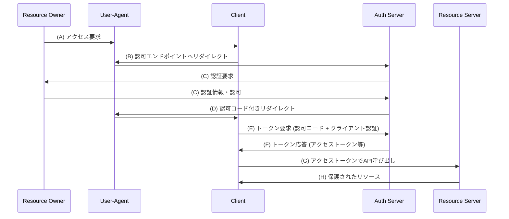
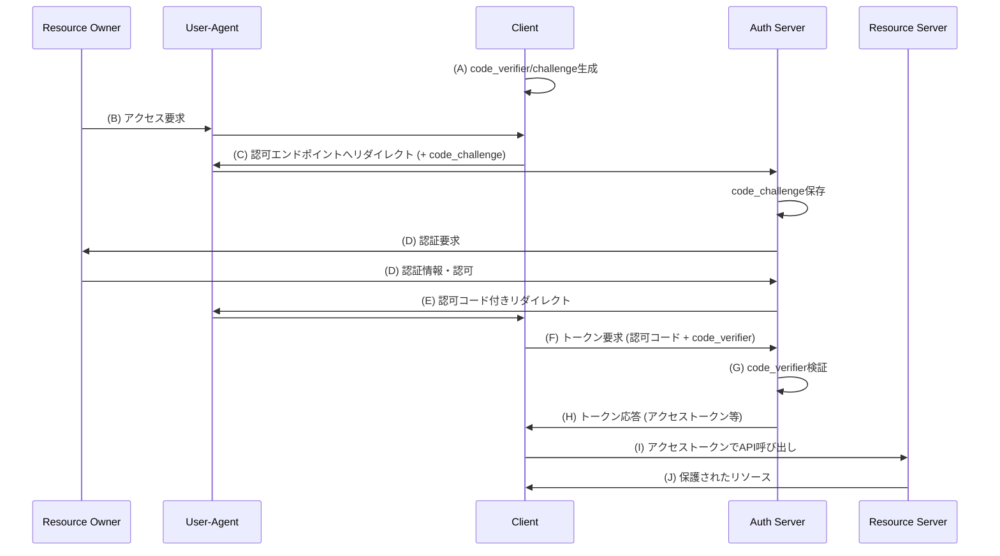

# SSRアプリケーションにおけるPKCE付き認可コードフロー

OAuth 2.0の認可コードフローとPKCEの仕組みを理解する

---

# 認可コードフローとは

OAuth 2.0で最も安全な認可フロー（RFC 6749）

- クライアントアプリケーションがユーザーの代わりにリソースサーバーにアクセスする権限を取得
- アクセストークンの直接的な露出を防ぐ
- クライアントシークレットによる追加のセキュリティ層
- Webアプリケーションで推奨される標準的なフロー

---

# 認可コードフローの流れ

---

# PKCE付き認可コードフローとは

Proof Key for Code Exchange (PKCE) - 認可コードフローの拡張（RFC 7636）

- パブリッククライアント（SPAやモバイルアプリ）向けのセキュリティ強化
- 認可コード横取り攻撃を防ぐ
- クライアントシークレットが安全に保管できない環境でも使用可能
- 動的に生成されるcode_verifierとcode_challengeを使用

---

# PKCE付き認可コードフローの流れ

---
